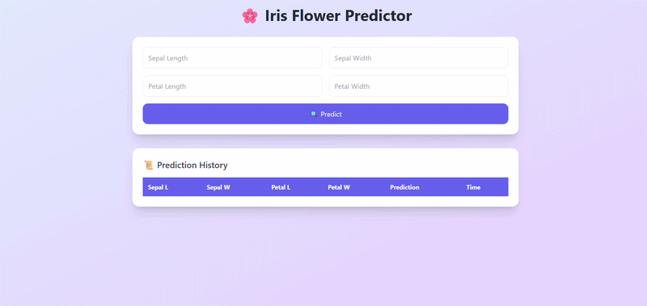

# 🌸 Iris Prediction Web App (Django + Machine Learning)

A simple **end-to-end Machine Learning web application** built using **Django** that predicts the species of an Iris flower based on user input.

---

---

# 🚀 Features

* 🌼 Predict Iris flower species:

  * Setosa
  * Versicolor
  * Virginica
* 🧠 Integrated ML model (Random Forest)
* 💾 Stores predictions in SQLite database
* 📜 Displays **current + previous predictions**
* ⚡ Clean and beginner-friendly project structure

---

# 🧠 Tech Stack

* **Backend:** Django
* **ML Model:** Scikit-learn (RandomForestClassifier)
* **Database:** SQLite (`db.sqlite3`)
* **Frontend:** HTML (Django Templates)
* **Model Storage:** Joblib (`.pkl` file)

---

# 📁 Project Structure

```
deep_learning_project/
│
├── manage.py
├── requirements.txt
│
├── myproject/
│   ├── settings.py
│   ├── urls.py
│
├── myapp/
│   ├── models.py
│   ├── views.py
│   ├── urls.py
│
│   ├── ml/
│   │   ├── model_loader.py
│   │   ├── predict.py
│   │   ├── preprocess.py
│
│   ├── templates/
│   │   └── index.html
│
├── model/
│   └── model.pkl
│
└── db.sqlite3
```

---

# ⚙️ Installation & Setup

## 1️⃣ Clone the Repository

```
git clone <your-repo-url>
cd deep_learning_project
```

---

## 2️⃣ Create Virtual Environment

```
conda create -n env310 python=3.10
conda activate env310
```

---

## 3️⃣ Install Dependencies

```
pip install -r requirements.txt
```

---

## 4️⃣ Train the Model

```
python train_model.py
```

✔ This creates:

```
model/model.pkl
```

---

## 5️⃣ Run Migrations

```
python manage.py makemigrations
python manage.py migrate
```

---

## 6️⃣ Start Server

```
python manage.py runserver
```

👉 Open in browser:

```
http://127.0.0.1:8000/
```

---

# 🧪 How It Works

1. User enters flower measurements:

   * Sepal Length
   * Sepal Width
   * Petal Length
   * Petal Width

2. Data is sent to Django backend

3. ML model predicts the class

4. Result is:

   * Displayed on screen
   * Saved in database

5. Previous predictions are shown in a table

---

# 📊 Example Input

```
Sepal Length: 5.1
Sepal Width: 3.5
Petal Length: 1.4
Petal Width: 0.2
```

### ✅ Output:

```
Setosa
```

---

# 💾 Database Model

```
IrisPrediction
- sepal_length (float)
- sepal_width (float)
- petal_length (float)
- petal_width (float)
- prediction (string)
- created_at (datetime)
```

---

# 🔥 Future Improvements

* 📈 Add charts/visualizations
* 🔐 User authentication system
* 🌐 REST API (Django REST Framework)
* ☁️ Deploy on Render / AWS
* 🤖 Replace with Deep Learning model (TensorFlow / PyTorch)

---

# 🙌 Acknowledgements

* Scikit-learn Iris Dataset
* Django Framework

---

# 📌 Author

**Umesh Samartapu**

---

# ⭐ If you like this project

Give it a ⭐ on GitHub and share with others!
